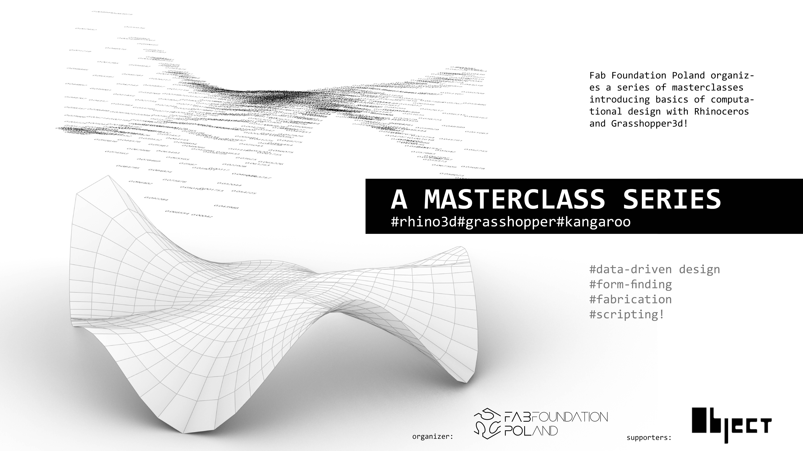

#**GH_MASx10**
#Grasshopper Masterclasses Series

## **Learn parametric design in 10 weekends!**

Fab Foundation Poland organizes a series of workshops introducing basics of computational design with Rhinoceros and Grasshopper3d!

For whom:
students and practitioners working in the areas of art, design, architecture, structural engineering, geometry processing, automation in the design practice

##**Check the detailed program!**

2-day masterclass every second weekend!

- **MASTERCLASS 1** | 27-28th April 2024 | user interface, geometry types, Rhino/GH connection
- **MASTERCLASS 2** | 11-12th May 2024 | data flow, paneling, geometry rationalization
- **MASTERCLASS 3** | 25-26th May 2024 | data I/O, excel, csv, data visualization,  geometry for fabrication
- **MASTERCLASS 4** | 08-09th June 2024 |  complex definitions, project organization and helpful plugins
- **MASTERCLASS 5** | 22-23th June 2024 | looping with Anemone, generative design
- **MASTERCLASS 6** | 06-07th July 2024 | automating tasks with Anemone, scripting introduction
- **MASTERCLASS 7** | 20-21th July 2024 | Kangaroo
- **MASTERCLASS 8** | 03-04th August 2024 | scripting
- **MASTERCLASS 9** | 17-18th August 2024 | user_defined_1 (flexible)
- **MASTERCLASS 10** | 31st Aug-1st Sept 2024 |user_defined_2 (flexible)

Tutors:

##**Registration**
soon open!

##**Visit Wrocław!**
coming soon
