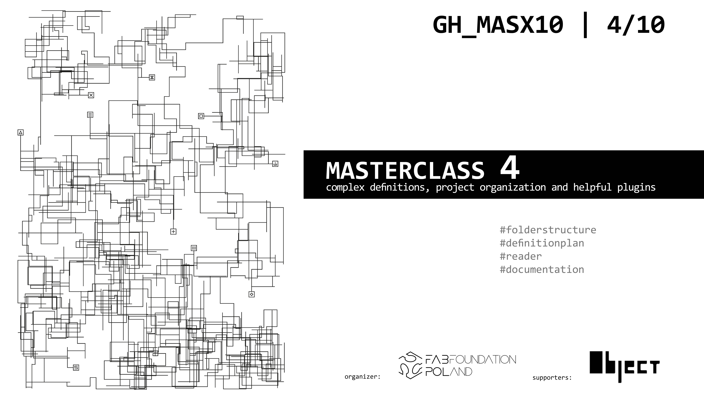

#**GH_MASx10**
#Grasshopper Masterclasses Series

## **Learn parametric design in 10 weekends!**

**Description:**

Join us for an immersive journey into the world of parametric design with our Rhino-Grasshopper Masterclass Series. Whether you're an architect, designer, engineer, or enthusiast eager to expand your skills, this series offers a comprehensive exploration of Rhino and Grasshopper, two powerful tools at the forefront of computational design.

Throughout the series, you'll delve deep into the principles and techniques of parametric modeling, guided by expert instructors with extensive experience in the field. From the basics of algorithmic design to advanced strategies for complex geometries, each session is carefully crafted to empower you with the knowledge and confidence to tackle real-world design challenges.

**What You'll Learn:**

- Understanding the fundamentals of parametric design

- Navigating the Rhino and Grasshopper interfaces with ease

- Creating parametric models to enhance design efficiency and flexibility

- Exploring advanced scripting techniques for custom solutions

- Integrating parametric design into your workflow for seamless collaboration and iteration

Whether you're a beginner eager to get started or a seasoned professional looking to sharpen your skills, the Rhino-Grasshopper Masterclass Series offers something for everyone. Don't miss this opportunity to unlock the full potential of parametric design and take your projects to new heights.

Join us and become a master of parametric design with Rhino and Grasshopper. Let your creativity soar like never before!

##**Location**:
All the masterclasses are onsite in Wrocław:

Fab Institute, Łokietka 12c, 50-243 Wrocław, Poland, [Fab Institute](https://fabfoundation.pl/nav/fablabs/fab-institute/)

##**Duration**:
2-day masterclass every second weekend! (Saturday 10.00AM-6.00PM, Sunday 10.00AM-6.00PM)

##**Check the detailed program!**

- **MASTERCLASS 1** | 27-28th April 2024 | user interface, geometry types, Rhino/GH connection
- **MASTERCLASS 2** | 11-12th May 2024 | data flow, paneling, geometry rationalization
- **MASTERCLASS 3** | 25-26th May 2024 | data I/O, excel, csv, data visualization,  geometry for fabrication
- **MASTERCLASS 4** | 08-09th June 2024 |  complex definitions, project organization and helpful plugins
- **MASTERCLASS 5** | 22-23th June 2024 | looping with Anemone, generative design
- **MASTERCLASS 6** | 06-07th July 2024 | automating tasks with Anemone, scripting introduction
- **MASTERCLASS 7** | 20-21th July 2024 | Kangaroo

summer break

CODING MASTERCLASS BUNDLE - take it seperate or together!

- **MASTERCLASS 8** | 21-22th September 2024 | scripting
- **MASTERCLASS 9** | 05-06th October 2024 | C#
- **MASTERCLASS 10** | 19-20th October 2024 |your GH component

##[Detailed Program](https://docs.google.com/document/d/1wSE3tbdQUosJFXzS0XVwUW4YGrsqglOkHP1cl40cTl8/edit?usp=sharing)

##**Visit Wrocław!**
Some recommended attractions: [visitwroclaw.eu](https://visitwroclaw.eu/en/)

 3-day in Wroclaw English guide: [pdf](https://visitwroclaw.eu/en/files-en/dokumenty/6535/3%20days%20in%20Wroclaw_EN.pdf)

#[**Register here**](https://forms.gle/rX2ixT3q4DdfnPGD9)

#[**Register here**](https://forms.gle/rX2ixT3q4DdfnPGD9)
