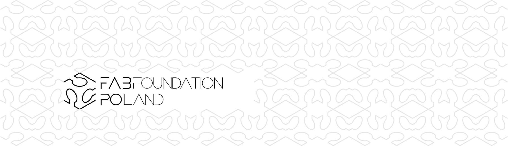
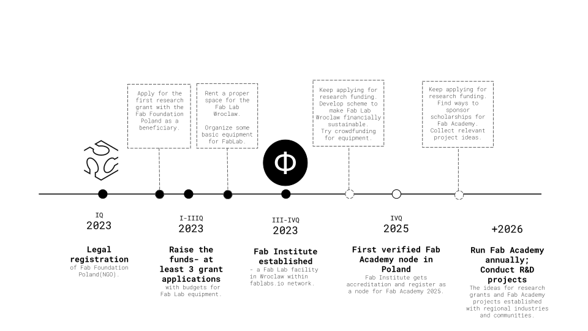
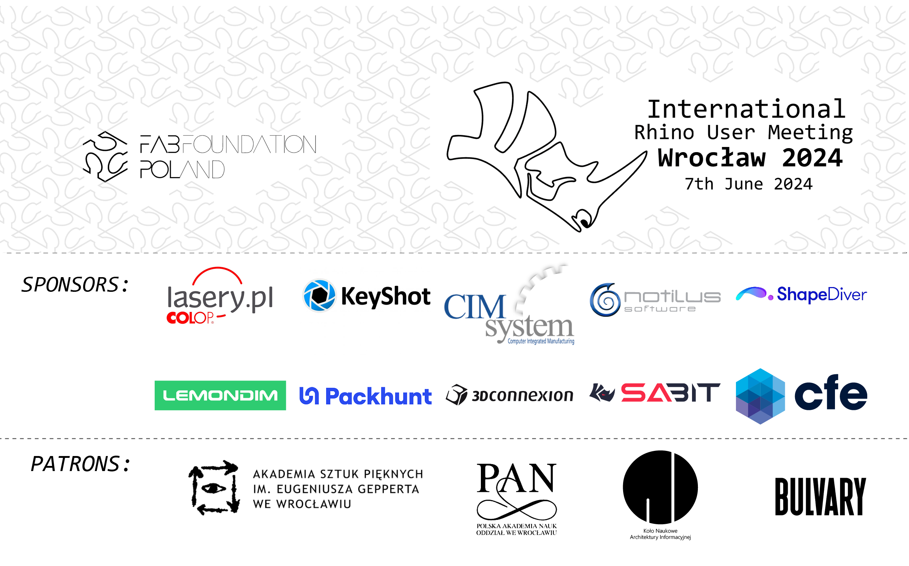

# Hello, digital world! | Hello, physical world!
by
## **Judy Curie | Ania Malinowska**

The Fab Foundation Poland - a Polish daughter of the [Fab Foundation](https://fabfoundation.org/). The Fab Foundation Poland aims to bridge the digital divide and conduct applied research into digital design & fabrication. The actions of the Fab Foundation Poland are primarily aimed for people living currently in Poland: Poles, Ukrainians and other people needing community, new job skills or a digitally fabricated house!

_____________________
# Fab Foundation Poland Road Map

_____________________
# FAB  INSTITUTE

_____________________
# FAB PRODUCTS

We design digital products for global market to be digitally fabricated  with local resources. Made on demand without the need for transpoort, they are both economic and ecological.

Available in online shops:
[**Etsy**](https://www.etsy.com/shop/FabFoundationPoland)  [**Cults3D**](https://cults3d.com/en/users/fabfoundationpoland/3d-models)
_____________________
# MAJORS EVENTS!

##[**Rhino User Meeting Europe 2024**](./rhinousermeeting2024.md) [**International Event**]

##[**GH Masterclass Series**](./ghmasterclass.md) [**Masterclasses**]

_____________________

made with [Simple Blog for MkDocs](https://github.com/FernandoCelmer/mkdocs-simple-blog)
