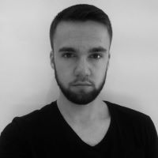

_______________
_______________

#**FFP Members**

By becoming an FFP Member, you join a dynamic collaboration platform at the forefront of computational design and digital fabrication in Poland. As an FFP Member, you'll enjoy a range of exclusive benefits.

#REGULAR MEMBERSHIP - 100PLN/YEAR

Regular membership is renewed annually. Active members benefits:

1. **Free or Discounted Access to the FFP Events** (10% discount for all our events e.g workshops, masterclasses or conferences)
2. **Machine Time at Fab Institute** (2h of machine time each 6 months)
3. **Access to Resources** (access to FFP Github database with selected example files from our courses, test files for lasercutting/3D printing, open-sorce projects, useful GH definitions and scripts, books and learning materials, open-source software)
4. **Access to database** ( FFP member database registeration in the FFP members database will allow you to find partners, collaborators or service, and help others to find you based on your sklils, intresets or owned equipment )
5. **Shape the maker movement in Poland and partipate in the global fab network** (as FFP member you will have opportunity to influance FFP development and shape Polish maker community by  expressing your opinion in choice of the educational topis, proposing topics for reserch projects, voting in the )
6. **Stay Connected and Informed** (you will be the first one to be infomed about FFP events, news from the global Fab Lab network: events, job, intership opportunities,  )

#EXLUSIVE ACTIVE MEMBERSHIP - 1000PLN/YEAR
Active FFP member is an individual who will enjoy

1. **All the benefits of regular member**

**and will have BUSINESS oportunites to work and earn with Fab Foundation POLAND:**

2. **As a EDU creator** - Possibilty to organize authorial workshops/courses/events with FFP legal, financial, marketing and physical infrustructure.

3. **As a PRODUCT creator** - Develop a product prototype, with access to currently available equipment in Fab Institute e.g. printer, laser cutter () 3D printer and vinel cutter soon available**, which you can turn into a business or pitch as FFP product.  Selected project proposals will be enhanced with FFP's state of art expertise in design optimization and fabrication and launched as FFP products, whie authors can simply enjoy the passive income from the sales!

4. **As a GRANT leader** - if you have a innovatire idea in the area of computational design and digital farbucation, which needs some research or experimentation to be proven, you can run your own research or R&D grants with Fab Foundation Poland as host institution! FFP recognized by EU as research organization and can serve as host institution for your research!.

#HONOROUABLE sponsors- 10000PLN/YEAR
Industry partners and individuals who supported FFP activites for public benefit with min. 10000PLN/year will enjoy

1. **All the benefits of the regular membership**

1. **Promotion at the website as honourable sponsors**.
2. **Participation in a selected FFP event as special guest**.

Stay connected, stay informed, receive new opportunities, find collaborators, enjoy FFP resources (books, codes, settings, designs), share problems, share ideas, share solutions, grow with us!
#[Become a FFP member](https://forms.gle/zVg4wFavTfXBH9VY8)
_______________
________

#**Tutors**

## **Judy Curie**

Judy Curie (Judyta Maria Cichocka) is a research-oriented designer and entrepreneur. Her primary focus centers on the application of Computational Intelligence methods in both structural and architectural design. Holding a PhD in architectural engineering from WRUT and an MEng in Structural Design and Mechanics from MIT, she brings a unique blend of academic rigor and practical expertise to her work. Judy was nominated by MIT for the SOM STRUCTURAL ENGINEERING RESEARCH GRANT  and also received the MIT Art Grant in 2019. She led courses at prestigious institutions such as Universität der Künste Berlin, Victoria University of Wellington School of Architecture and Design, BTU Cottbus, and Wroclaw University of Science and Technology. She has served as a workshop leader at renowned international events like AAG, IASS, CAADRIA, ACADIA.  Throughout her career, Judy has imparted knowledge to over 300 students, researchers, and professionals through academic courses, onsite workshops, and online training sessions.

Judy  will equip you analytical thinking and skills to verify the structural and/or fabrication soundness of your design concepts. While her profound knowledge in Architectural Design Optimization is particularly beneficial for scientifically inclined students, she also possesses the ability to empower practitioners with straightforward optimization approaches to elevate designs for digital production, customization, and ultimately enhance their market competitiveness.

Judy is well-equipped to recommend pertinent research papers, suggest contacts within the field, highlight relevant events to attend, and point out university programs or grants aligned with your interests and goals. With her support, you can not only enhance the robustness of your designs but also chart a strategic path towards your aspirations in the realms of structural and architectural design.

More at: [judycurie.com](https://judycurie.com/)

_____________________________

## **Szymon Loj**

Szymon is an accomplished Architectural Assistant with a proven track record in the public architecture sector. His expertise lies in Building Information Modeling (BIM) and proficiency in various 3D modeling software such as Rhinoceros and Grasshopper3d. He specializes in Parametric Design, Parametric Modeling, and Geometry.

With an Engineer's degree in Architecture from Wroclaw University of Science and Technology, he brings a strong academic foundation into practice. His current focus is on expanding knowledge in computational design, programming, and digital fabrication. He is dedicated to incorporating these advanced skills into architectural and product design work, enhancing innovation and efficiency in the fields.

Szymon is a co-founder of [MatchIt!](https://www.instagram.com/matchitholds/) - an innovative enterprise producing high-quality timber holds for climbing purposes. All [MatchIt!](https://www.instagram.com/matchitholds/) products are parametrically designed and fabricated with CNC machines. Szymon is highly skilled in C# programming in Grasshopper and automation of digital production. He can teach you how to create your own product, optimize it for production, and make customization effortless. His passion for climbing is contagious, therefore taking workshop with him may convert you into computational design and/or climbing geek :)

More at: [www.linkedin.com](https://www.linkedin.com/in/szymon-%C5%82%C3%B3j-93250b179/?originalSubdomain=pl)
