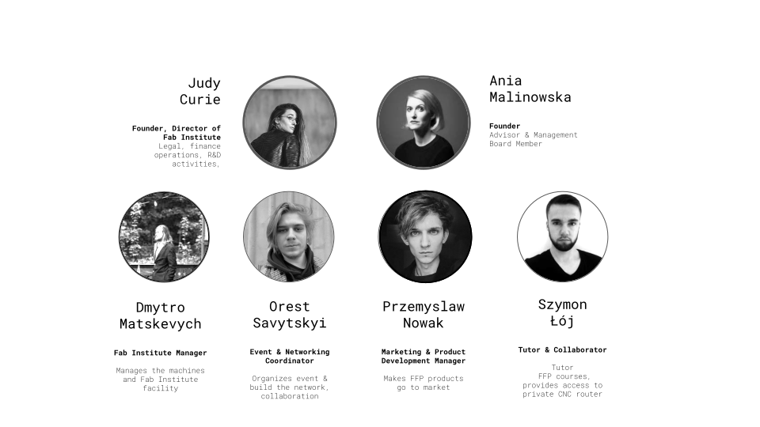

# People

# **Judy Curie**- Founder & Director of Fab Institute

Judy Curie (Judyta Maria Cichocka) is a research-driven designer and entrepreneur specializing in Computational Intelligence methods applied to structural and architectural design. Holding a PhD in architectural engineering from WRUT and an MEng in Structural Design and Mechanics from MIT, she combines academic expertise with hands-on experience in digital fabrication and structural optimization. She was an MIT nominee for the SOM Structural Engineering Research Grant and a recipient of the MIT Art Grant in 2019. Judy has taught at institutions such as Universität der Künste Berlin, Victoria University of Wellington, BTU Cottbus, and Wroclaw University of Science and Technology, while also leading workshops at AAG, IASS, CAADRIA, and ACADIA. Having taught over 300 students, she excels in translating complex optimization concepts into practical strategies for digital production and market-ready design. As the founder of Fab Foundation Poland, she aims to establish a Fab Academy Node and advance cutting-edge research in digital fabrication, merging high-tech computational methods with local materials and low-tech production techniques to empower communities. Beyond education, she provides strategic guidance, recommending research papers, industry contacts, and funding opportunities to help designers and researchers refine their work and navigate their professional paths.

More at: [judycurie.com](https://judycurie.com/);
[linkedin- judycurie](https://www.linkedin.com/in/judycurie/)[judycurie](https://www.instagram.com/judycurie/)

_________

# **Ania Malinowska** - Founder

Ania Malinowska is an author, a cultural theorist and Associate Professor in Media and Cultural Studies at the Faculty of Humanities, University of Silesia (Poland), and a former Senior Fulbright Fellow at the New School of Social Research in New York. She is also a founding member of the Centre for Critical Technology Studies (University of Silesia). Her research concentrates on cultural theory, love studies, digital humanities, and critical robotics – and specifically on the formation of cultural norms and the social, emotional, and aesthetic codes in relation to digitalism.

More at [www.ccts.us.edu.pl](https://www.ccts.us.edu.pl/)

__________

# **Orest Savytskyi**- Event & Networking Coordinator

Organizes event & build the network, collaboration

More at [orestsavytskyi](https://www.instagram.com/orestsavytskyi/)

________

# **Dmytro Matskevych**- Fab Institute Manager

Manages the machines and Fab Institute facility

More at [neohutsul_photo](https://www.instagram.com/neohutsul_photo/)

_____________________

# **Przemyslaw Nowak**- Marketing & Product Development Manager

Makes FFP products go to market

More at [hashtagpszemek](https://www.instagram.com/hashtagpszemek/)

_____________________________

# **Szymon Loj**- TUTOR & COLLABORATOR

Szymon is an accomplished Architectural Assistant with a proven track record in the public architecture sector. His expertise lies in Building Information Modeling (BIM) and proficiency in various 3D modeling software such as Rhinoceros and Grasshopper3d. He specializes in Parametric Design, Parametric Modeling, and Geometry.

With an Engineer's degree in Architecture from Wroclaw University of Science and Technology, he brings a strong academic foundation into practice. His current focus is on expanding knowledge in computational design, programming, and digital fabrication. He is dedicated to incorporating these advanced skills into architectural and product design work, enhancing innovation and efficiency in the fields.

Szymon is a co-founder of [MatchIt!](https://www.instagram.com/matchitholds/) - an innovative enterprise producing high-quality timber holds for climbing purposes. All [MatchIt!](https://www.instagram.com/matchitholds/) products are parametrically designed and fabricated with CNC machines. Szymon is highly skilled in C# programming in Grasshopper and automation of digital production. He can teach you how to create your own product, optimize it for production, and make customization effortless. His passion for climbing is contagious, therefore taking workshop with him may convert you into computational design and/or climbing geek :)

More at: [linkedin- szymon](https://www.linkedin.com/in/szymon-%C5%82%C3%B3j-93250b179/?originalSubdomain=pl)

_____________________________

# **Agnieszka Nowacka** -Tutor

Agnieszka is currently working in [Object](https://object.pl/).

"As an architect passionate about computational design, I've honed my skills through university courses, online learning, and self-driven projects. Initially focused on ecology and sustainability, my interest evolved towards computational design and advanced technologies. I now strive to merge these fields for innovative, eco-friendly architectural solutions.

Outside of my professional interests, I have founded a lighthearted YouTube channel and enjoy exploring the world, with special interest in forests, mountains and ruins.

I am always open to connecting with others, collaborating on projects, and sharing ideas. If you have any inquiries or simply wish to discuss computational design, sustainability, or anything related to architecture, please don't hesitate to reach out!"

More at: [linkedin-agnieszka](https://pl.linkedin.com/in/agnieszka-nowacka-661a39260?original_referer=https%3A%2F%2Fwww.google.com%2F)

____________________________________________

# **Kuba Oszczyk** -Tutor

Kuba is currently working in [Object](https://object.pl/).

Kuba is an enthusiastic, self-thought computational designer and software engineer. He has been working in Object since 2021. In his practice he consults and provides technological advancements to various companies. He works primarily in backend, implementing innovative mathematical solutions in .NET.

He graduated with the MSc Arch. from the Warsaw University of Technology, Faculty of Architecture in 2022. With a strong background in design and mathematics, he immediately became an academic tutor at his alma mater and started conducting classes in parametric design and robotics.

In the spring of 2024, he started a collaboration with the fully accredited online university of DesignMorphine, where he offered his programming expertise as an educator and a chapter lead.  

Some say he looks best on the dancefloor, as he is a former professional ballroom dancer. ;)

More at: [linkedin-agnieszka](https://pl.linkedin.com/in/agnieszka-nowacka-661a39260?original_referer=https%3A%2F%2Fwww.google.com%2F)

______________________________________________________
