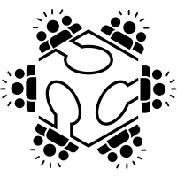
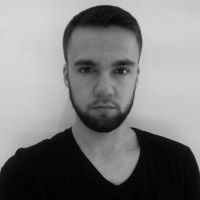

_______________

#**Tutors**

## **Judy Curie**

Judy Curie (Judyta Maria Cichocka) is a research-oriented designer and entrepreneur. Her primary focus centers on the application of Computational Intelligence methods in both structural and architectural design. Holding a PhD in architectural engineering from WRUT and an MEng in Structural Design and Mechanics from MIT, she brings a unique blend of academic rigor and practical expertise to her work. Judy was nominated by MIT for the SOM STRUCTURAL ENGINEERING RESEARCH GRANT  and also received the MIT Art Grant in 2019. She led courses at prestigious institutions such as Universität der Künste Berlin, Victoria University of Wellington School of Architecture and Design, BTU Cottbus, and Wroclaw University of Science and Technology. She has served as a workshop leader at renowned international events like AAG, IASS, CAADRIA, ACADIA.  Throughout her career, Judy has imparted knowledge to over 300 students, researchers, and professionals through academic courses, onsite workshops, and online training sessions.

Judy  will equip you analytical thinking and skills to verify the structural and/or fabrication soundness of your design concepts. While her profound knowledge in Architectural Design Optimization is particularly beneficial for scientifically inclined students, she also possesses the ability to empower practitioners with straightforward optimization approaches to elevate designs for digital production, customization, and ultimately enhance their market competitiveness.

Judy is well-equipped to recommend pertinent research papers, suggest contacts within the field, highlight relevant events to attend, and point out university programs or grants aligned with your interests and goals. With her support, you can not only enhance the robustness of your designs but also chart a strategic path towards your aspirations in the realms of structural and architectural design.

More at: [judycurie.com](https://judycurie.com/);
[linkedin- judycurie](https://www.linkedin.com/in/judycurie/)

_____________________________

## **Szymon Loj**

Szymon is an accomplished Architectural Assistant with a proven track record in the public architecture sector. His expertise lies in Building Information Modeling (BIM) and proficiency in various 3D modeling software such as Rhinoceros and Grasshopper3d. He specializes in Parametric Design, Parametric Modeling, and Geometry.

With an Engineer's degree in Architecture from Wroclaw University of Science and Technology, he brings a strong academic foundation into practice. His current focus is on expanding knowledge in computational design, programming, and digital fabrication. He is dedicated to incorporating these advanced skills into architectural and product design work, enhancing innovation and efficiency in the fields.

Szymon is a co-founder of [MatchIt!](https://www.instagram.com/matchitholds/) - an innovative enterprise producing high-quality timber holds for climbing purposes. All [MatchIt!](https://www.instagram.com/matchitholds/) products are parametrically designed and fabricated with CNC machines. Szymon is highly skilled in C# programming in Grasshopper and automation of digital production. He can teach you how to create your own product, optimize it for production, and make customization effortless. His passion for climbing is contagious, therefore taking workshop with him may convert you into computational design and/or climbing geek :)

More at: [linkedin- szymon](https://www.linkedin.com/in/szymon-%C5%82%C3%B3j-93250b179/?originalSubdomain=pl)

_____________________________

## **Agnieszka Nowacka**

Agnieszka is currently working in [Object](https://object.pl/).

"As an architect passionate about computational design, I've honed my skills through university courses, online learning, and self-driven projects. Initially focused on ecology and sustainability, my interest evolved towards computational design and advanced technologies. I now strive to merge these fields for innovative, eco-friendly architectural solutions.

Outside of my professional interests, I have founded a lighthearted YouTube channel and enjoy exploring the world, with special interest in forests, mountains and ruins.

I am always open to connecting with others, collaborating on projects, and sharing ideas. If you have any inquiries or simply wish to discuss computational design, sustainability, or anything related to architecture, please don't hesitate to reach out!"

More at: [linkedin-agnieszka](https://pl.linkedin.com/in/agnieszka-nowacka-661a39260?original_referer=https%3A%2F%2Fwww.google.com%2F)

____________________________________________

## **Kuba Oszczyk**

Kuba is currently working in [Object](https://object.pl/).

Kuba is an enthusiastic, self-thought computational designer and software engineer. He has been working in Object since 2021. In his practice he consults and provides technological advancements to various companies. He works primarily in backend, implementing innovative mathematical solutions in .NET.

He graduated with the MSc Arch. from the Warsaw University of Technology, Faculty of Architecture in 2022. With a strong background in design and mathematics, he immediately became an academic tutor at his alma mater and started conducting classes in parametric design and robotics.

In the spring of 2024, he started a collaboration with the fully accredited online university of DesignMorphine, where he offered his programming expertise as an educator and a chapter lead.  

Some say he looks best on the dancefloor, as he is a former professional ballroom dancer. ;)

More at: [linkedin-agnieszka](https://pl.linkedin.com/in/agnieszka-nowacka-661a39260?original_referer=https%3A%2F%2Fwww.google.com%2F)
