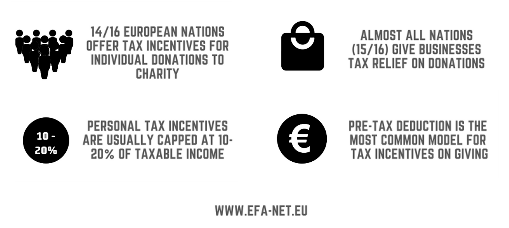

Fab Foundation Poland is a non-profit NGO organization conducting public benefit activities in the  scientific and technical, educational, cultural and artistic spheres. In most of the countries the donations for the Fab Foundation Poland are tax-deducitble. This means that any financial or material donation you make can reduce your tax in the following year.

Below some hints how to get a tax-reduction if you are a tax-payer in the below countries.

## Tax-payers in European Union (EU) or the European Economic Area (EEA).

European taxpayers can deduct from tax donations made to public benefit organizations in another EU country, the Court of Justice of the EU in Luxembourg ruled in 2009.
The Court made it clear that if a public benefit organization fulfills the conditions laid down in another Member State "and aims to promote identical interests", "the authorities of that Member State may not deny such an organization the right to equal treatment on the sole ground that it does not have established in its territory.

source: https://ec.europa.eu/commission/presscorner/detail/en/CJE_09_5

To deduce from the tax the donation to the Fab Foundation Poland, check with your national tax office what documents you need, send us a email with the list of required documents. We will  provide you the necessary documents.

### Tax-payers in Poland

**Darowizny na działalność pożytku publicznego**

"Darowizny można odliczyć od podstawy opodatkowania na liczne cele, które są określone w przepisach ustawy z dnia 24 kwietnia 2003 r. o działalności pożytku publicznego i wolontariacie. Chodzi m.in. o wspieranie rodzin i osób w trudnej sytuacji życiowej, działalności charytatywnej i na rzecz osób niepełnosprawnych, ochrony i promocji zdrowia czy ^^nauki, szkolnictwa wyższego i edukacji^^.

W zeznaniu ^^możesz odliczyć kwotę faktycznie przekazanej darowizny, nie więcej jednak niż 6% Twojego dochodu^^.

Darowiznę możesz przekazać na rzecz:

-organizacji pozarządowych (np. fundacji i stowarzyszeń), które nie są jednostkami sektora finansów publicznych i nie działają w celu osiągnięcia zysku [...]

Darowiznę należy udokumentować:

-dowodem wpłaty na rachunek płatniczy obdarowanego lub jego rachunek w banku, inny niż rachunek płatniczy – w przypadku darowizny pieniężnej,

-dowodem, z którego wynikają dane identyfikujące darczyńcę oraz wartość przekazanej darowizny wraz z oświadczeniem obdarowanego o jej przyjęciu – w przypadku darowizny niepieniężnej."

source: https://www.podatki.gov.pl/pit/twoj-e-pit/pit-37-za-2022/#opp

**Jak odpisać od podatku darowiznę na Fundację Fab Foundation Poland?**

- wpłacić na konto fundacji kwotę nie przekraczającą 6% dochodu
- zachować dowód wpłaty
- w tytule przelewu podać cel darowizny mieszczący się w sferach pożytku publicznego
 (wybierz jeden): “na cele pożytku publicznego: działalność w zakresie nauki, szkolnictwa wyższego, edukacji, oświaty i wychowania”/“na cele pożytku publicznego: działalności wspomagającej rozwój gospodarczy, w tym rozwój przedsiębiorczości”/“na cele pożytku publicznego: działalności wspomagającej rozwój techniki, wynalazczości i innowacyjności oraz rozpowszechnianie i wdrażanie nowych rozwiązań technicznych w praktyce gospodarczej”/ “na cele pożytku publicznego: działalności na rzecz integracji europejskiej oraz rozwijania kontaktów i współpracy między społeczeństwami”/ “na cele pożytku publicznego: działalności na rzecz osób w wieku emerytalnym”
- w kolejnym roku podatkowym wpłaconą kwotę możesz odliczyć od podatku dochodowego: [instrukcja](tax-poland.md)

## Tax payers outside the European Union or the European Economic Area (EEA).

Check with your national tax office, if donations to a non-profit NGO conducting activities for public benefit located in Poland are tax-deductible. If yes, send us a list of documents you need to submit and we will do our best to provide you with all you need.
