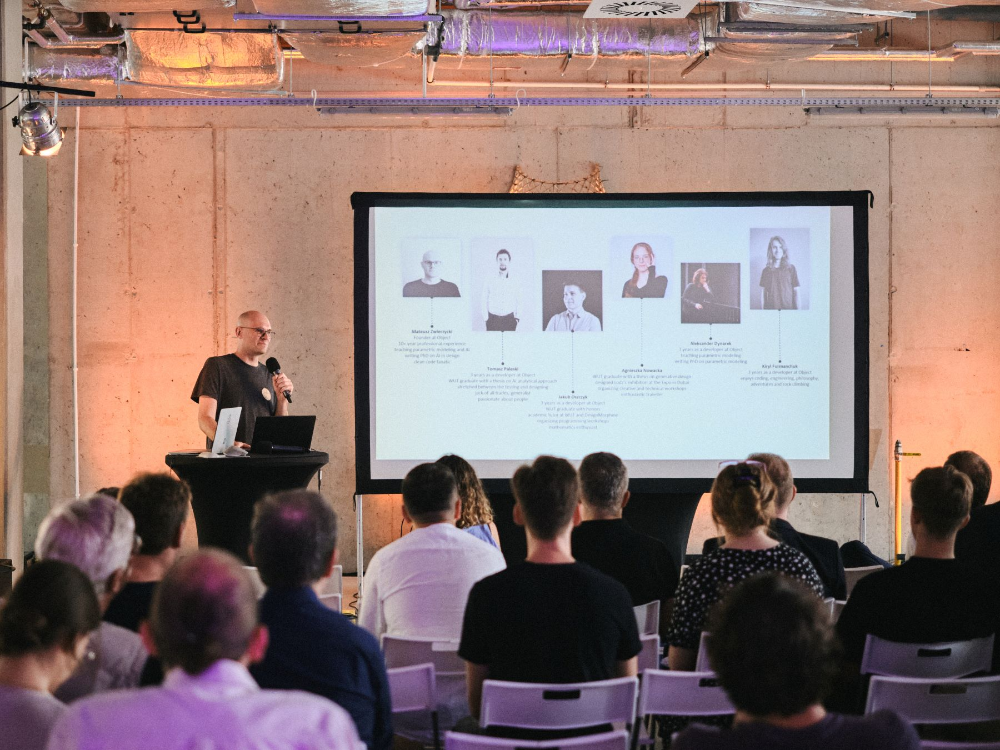
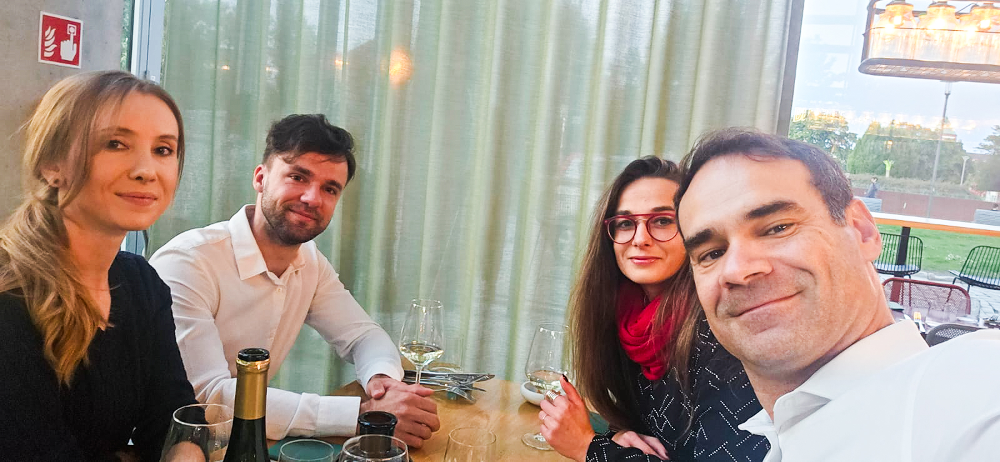

##Fab Foundation Poland Calendar
<iframe src="https://embed.styledcalendar.com/#aFbvYAu8NK0vnQRctX10" title="Styled Calendar" class="styled-calendar-container" style="width: 100%; border: none;" data-cy="calendar-embed-iframe"></iframe>

[FFP] - events orgnized by Fab Foundation Poland
[GLOBAL]* - international events (not organized by Fab Foundation Poland)

[Copy our calendar](https://calendar.google.com/calendar/u/0?cid=ZmFiZm91bmRhdGlvbnBvbGFuZEBnbWFpbC5jb20)

#**2023**
1. [231216- Christmas Dinner](./e001.md) [**Social Event**]

#**2024**

1. [240124- 1st Fab Academy 2024](./e002.md) [**First Lecture**]
2. [240131- 2nd Fab Academy 2024](./e002.md) [Lecture]

3. [240207 - 3rd Fab Academy 2024](./e002.md) [Lecture]
4. [240214 - 4th Fab Academy 2024](./e002.md) [Lecture]
5. [240221 - 5th Fab Academy 2024](./e002.md) [Lecture]
6. [240228 - 6th Fab Academy 2024](./e002.md) [Lecture]

8. [240306 - 7th Fab Academy 2024](./e002.md) [Lecture]
9. [240313 - 8th Fab Academy 2024](./e002.md) [Lecture]
7. [240316 - OPTISHELL - asymptotic gridshells](./optishell.md) [**Workshop**]
10. [240320 - 9th Fab Academy 2024](./e002.md) [Lecture]
11. [240327 - 10th Fab Academy 2024](./e002.md) [Lecture]

8. [240403 - 11th Fab Academy 2024](./e002.md) [Lecture]
9. [240410 - 12th Fab Academy 2024](./e002.md) [Lecture]
10. [240417 - 13th Fab Academy 2024](./e002.md) [Lecture]
11. [240424 - 14th Fab Academy 2024](./e002.md) [Lecture]
10. [240427 - GH Masterclass 1 - user interface, geometry types, Rhino/GH connection](../ghmasterclass.md) [**Masterclass**]

8. [240501 - 15th Fab Academy 2024](./e002.md) [Lecture**only online]
9. [240508 - 16th Fab Academy 2024](./e002.md) [Lecture]
10. [240511 - GH Masterclass 2 - data flow, paneling, geometry rationalization](../ghmasterclass.md) [**Masterclass**]
10. [240515 - 17th Fab Academy 2024](./e002.md) [Lecture]
11. [240522 - 18th Fab Academy 2024](./e002.md) [Lecture]
10. [240525 - GH Masterclass 3 - data I/O, excel, csv, data visualization, geometry for fabrication](../ghmasterclass.md) [**Masterclass**]
11. [240529 - 19th Fab Academy 2024](./e002.md) [Lecture]

11. [240605 - 20th Fab Academy 2024](./e002.md) [**last Lecture**]
1. [240607 - Rhino User Meeting Europe](../rhinousermeeting2024.md) [**International Event**]
10. [240608 - GH Masterclass 4 - complex definitions, project organization and helpful plugins](../ghmasterclass.md) [**Masterclass**]
10. [240622 - GH Masterclass 5 - looping with Anemone, generative design](../ghmasterclass.md) [**Masterclass**]

10. [240706 - GH Masterclass 6 - automating tasks with Anemone, scripting introduction](../ghmasterclass.md) [**Masterclass**]
10. [240720 - GH Masterclass 7 - Kangaroo](../ghmasterclass.md) [**Masterclass**]

10. [240921 - GH Masterclass 8 - scripting](../ghmasterclass.md) [**Masterclass**]
11. 240928 -  Meet & Code Laser Cut (to be confirmed)

10. [241005 - GH Masterclass 9 -C#](../ghmasterclass.md) [**Masterclass**]
11. 241012 -  Meet & Code 3D Print (to be confirmed)

10. [241019 - GH Masterclass 10 - user_defined_2](../ghmasterclass.md) [**Masterclass**]
11. 241026 -  Meet & Code Electronics (to be confirmed)

#**2025**

1. 250101- Fab New Year Eve [**Social Event**]

1. [250401 - Monthly Product Meeting](./e006.md)
1. [250429 - Monthly Product Meeting](./e006.md)
1. [250521 - MIT City Science at FFP](./e007.md) [**Guest Lecture / Social Event**]

1. 250526 - Meeting at Educational Reserach Institute (IBE)
1. 250610  -Women In Tech 2025, Warsaw, PL

1. [250625 - Monthly Product Meeting](./e006.md)
1. 250709 - Visit at ETH - Design++, Zurich, CH
1. 250716 - Visit at Kassel EDEK, Kassel, DE
1. [250723- Monthly Product Meeting](./e004.md)

1. 250728 - FFP Stand at Oriental Garden Event, Labiszyn, PL
1. [250806 - Monthly Product Meeting](./e004.md)

1. [250902- Visiting Lecture- Gabriela Bila MIT, Media Lab](./e005.md) [**Guest Lecture / Social Event**]

1. [251006- Intro to Rhino3D Workshop](./e005.md) [**Workshop**]
1. [251020- AI for 3D Workshop](./e005.md) [**Workshop**]
1. [251022- 3Demand Product Meeting](./e008.md)

1. [251025- Opening of M Office](./e005.md) [**Social Event**]

**Fig.** GH Masterclass 1, 28th April 2024.

**Fig.** International Rhino User Meeting Wroclaw 2024. 7th June 2024, @ credit: Krzysztof Nazar, shared in courtesy of Fab Foundation Poland

**Fig.** Lecture of Prof. Luis Alonso (MIT Media Lab), 21st May 2025.

**Fig.** Lecture of Prof. Luis Alonso (MIT Media Lab) 21st May 2025.

**Fig.** First Christmas Dinner. 16th December 2024. 

**Fig.** Fab Academy Lecture Screening, Bulvary, 2024.

**Fig.** Fab NYE 2024.
