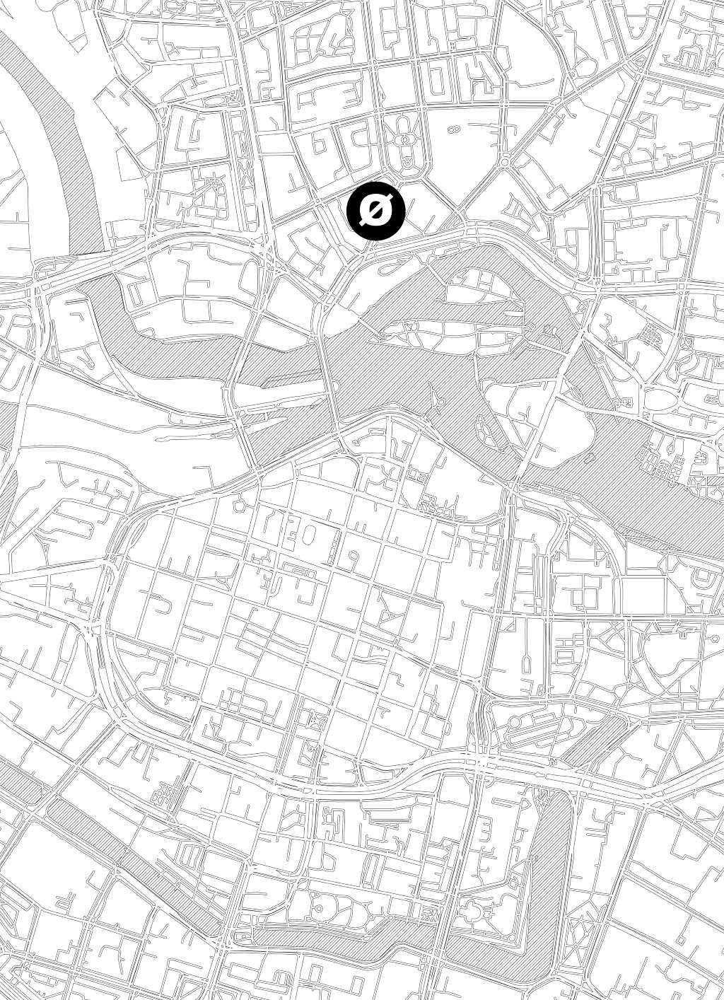
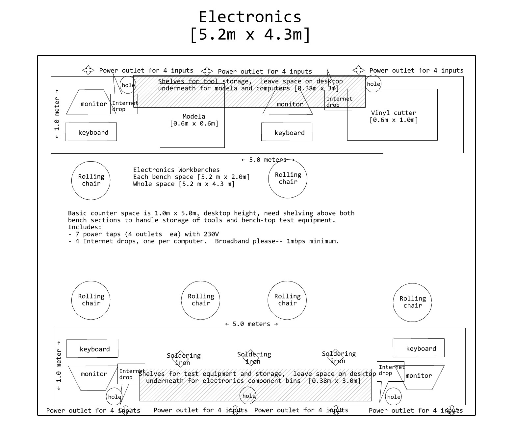

## **ABOUT Fab Institute**
We have just established a new facility in Wrocław.

Fab Institute aims to transform into maker space/ Fab Lab unit. At the momement it offers desks and offices for rent with access to laser cutter and 3D printer. Fab institute can also host weekend workshops, masterclasses, lectures, exhibitions.

##**Fab Institute - Location**
**Address**: Fab Institute, Łokietka 12c, 50-243 Wrocław, Poland

**Fig.** Fab Institute in the city center of Wrocław.

**Fig.** Entrance to the Fab Institute from Brodatego Street.

##**Fab Institute - Facility**

**Fig.** The current arrangement with individual offices and 10 desks to rent.

#**For rent!**

##**Desks in comaking space**

- **capacity:** 1 person
- **area:** an individual dedicated workspace in the large co-making area including large comfortable desk 140x70cm, chair and a desk cupboard
- **features:** access to shared fully-equiped kitchen, bathroom and call room (with a reservation system to meet clients or to run virtual meetings in private)
- **price:** 600PLN/month including everything (heating, water, electricity, internet)
- **check availability with Judy:** +48 602 698 242
- [**pay with card**](https://buy.stripe.com/9B6eVd4Edfm2cKweLvgw009)

##**Office XS**

- **capacity:** 1-3 people
- **area:** 11.8m2
- **features:** access to shared fully-equiped kitchen, bathroom and call room (a dedicated room for comaking space and XS office users to run virtual meetings in private)
- **price:** 1500PLN/month including everything (heating, water, electricity, internet)
- **check availability with Ania:** +48 602 698 242

##**Office M (Meeting Room)**

- **capacity:** 4-6 people
- **area:** 26.2m2
- **features:** individual entrance, exlusive kitchen and bathroom, equipped with white board and large screen
- **price:** 2500PLN/month including everything (heating, water, electricity, internet)
- **rent for days**: possibility to rent the office ocassionly for days (min. one day), or for reccurent events (e.g. 2 days each week, or one weekend in a month), prices are negotiated based on the request
- **check availability with Judy:** +48 602 698 242

#**Fab Institute to be**

**Fig.** The target arrangement for Fab Institute (a Fab Academy node).

#**Fab Lab Model**

We are working on finding proper spaces and establishing new Fab Lab facilities in Poland.
We are looking for the spaces of around 100-500m2 with preferably 3.5-4m height. The model fablab spaces are sketed below. The provided drawings were prepared based on the [how to start a fab lab](https://fabfoundation.org/getting-started/#fab-lab-questions).

