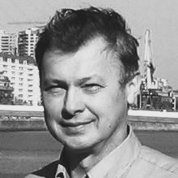

# International Scientific Council (ISC)

International Scientific Council is a scientific, advisory and representative body of the Foundation. The members of the International Scientific Council are world-class scientists and experts in the field of digital design, fabrication, technology and art. Members of ISC advise on and lead research projects carried out by Fab Foundation Poland. 

____________________________

### ** Prof. Jacek Kościuk**

Prof. Kościuk is an innovator in the application of 3D scanning for creating digital documentation of historical and archeological objects. 3D laser scanning, modeling and simulations not only enhance the heritage documentation with the 3D digital twins, but it also can aid dating the objects by analysis of brics dimensions or helped to discover the ancient Incaic measuring units. The 3D documentation made with sub-millimeter precision is of key importance for monitoring atmospheric and climatic factors causing erosion processes and implementing proper conservation programs. Over 40 years of experience in building archaeology and architectural monument preservation in Poland and worldwide, including +15 sites from the UNESCO World Heritage List e.g.  Temple of Hatshepsut in Deir el-Bahari (Egypt), El Fuerte de Samaipata (Bolivia), Corikancha temple in Cusco and  Machu Picchu (Peru). 

In 2007 he founded the  the Laboratory of 3D Scanning and Modeling within Wroclaw University of Technology and Science (TU Wroclaw), which he was supervising as a head-director. Prof. Kościuk was the first professor in Poland who supervised doctoral thesis into digital design, 3D scanning, simulation and optimization. Thanks to him the Laboratory of Digital Fabrication [LabDigiFab](https://labdigifab.wordpress.com/) was funded within TU Wroclaw. This student organization was a unique opportunity at that time to get skills and knowledge about digital design and fabrication. The former students of LabDigiFab, continued their education graduating from among others MIT, UCL Bartlett or ICD Stuttgart.  During its activity LabDigiFab organized in 2015 first in Poland International Conference of Parametric Design *Shapes of Logic* [link](https://shapesoflogic.wordpress.com/), followed in 2017 by its second edition [link](https://es-la.facebook.com/shapesoflogic/). 

In 2020 Prof. Kosciuk was awarded the highest scientific nomination by the Polish President. By younger generations he is often referred to as a father (or a god father) of bringing new technologies into architectural education in Poland. 

More at: [linkedin](https://www.linkedin.com/in/jacek-ko%C5%9Bciuk-1347452/)

____________________________

### **Prof. Janusz Rębielak**

Polish architect and constructor, professor of technical sciences. He has been workingat the Cracow University of Technology (TU
Cracow) since 2008. He was a head of Chair of Structures and Construction Engineering and moreover Manager of the Postgraduate Study “Building Information Modeling – digital technologies in architecture and construction” of*Building Information Modeling - Digital Technologies in Architecture and Construction* at the TU Cracow. His research work evolves around numerical methods for shaping spatial structures as well as proposals for their applications for high span roof systems, high-rise buildings and the innovative methods of their safe foundation on soils with poor load capacity, especially in mining damage and seismically active areas. His original system of a complex foundation is a breakthrough
technical solution in this area of engineering activities. He also developed a two -stage method of solving statically indeterminate trusses and a method of deformation of the secondary mesh, the latter was developed for the needs of designing geodesic domes. He published over 230 scientific papers. In 2006 the President of the Republic of Poland gave him the title of professor.

Prof. Rębielak has been a Chairman of the Committee on Architecture and Urban Planning of the of Wroclaw Branch of the Polish Academy
of Sciences (PAN) since 2006 and he was member of some national and international scientific societies as well as a member of scientific
boards or editorial committees of national and international scientific journals; at present, among others, a member of the Editorial Board of The International Journal of Computational Methods (IJCM).

More at: [wikipedia](https://pl.wikipedia.org/wiki/Janusz_R%C4%99bielak)
