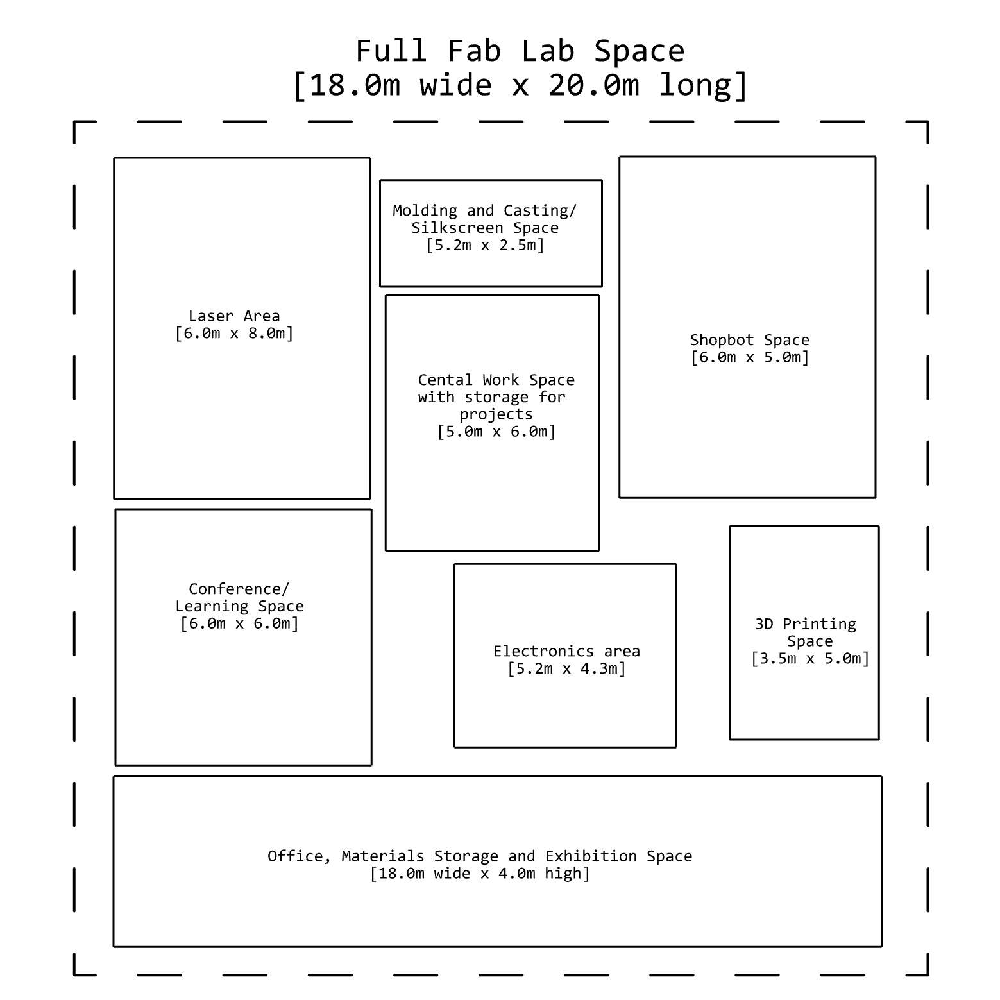
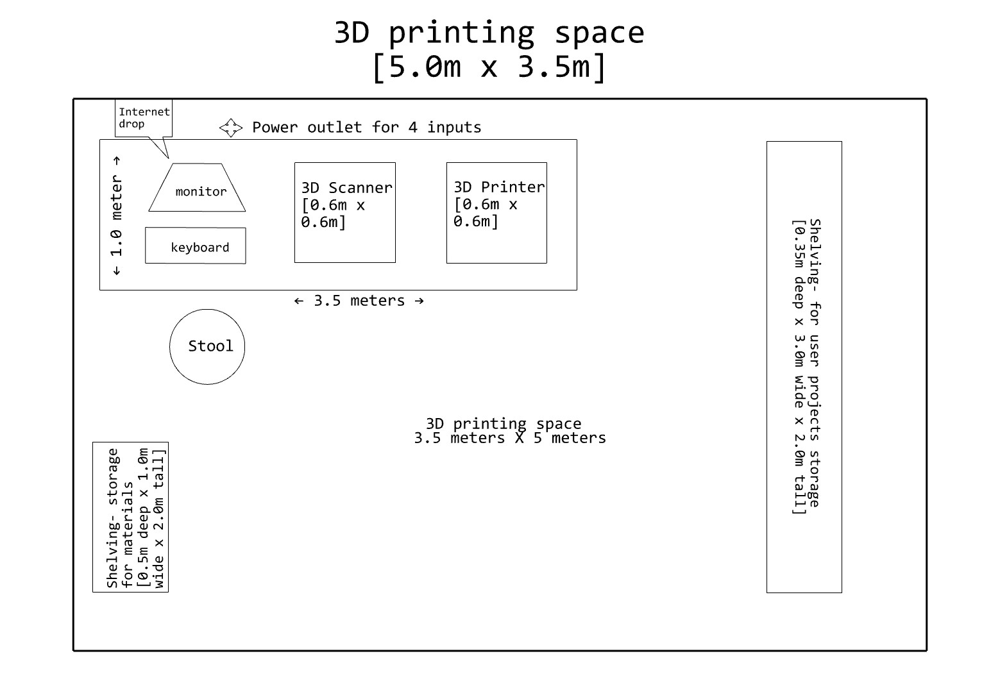
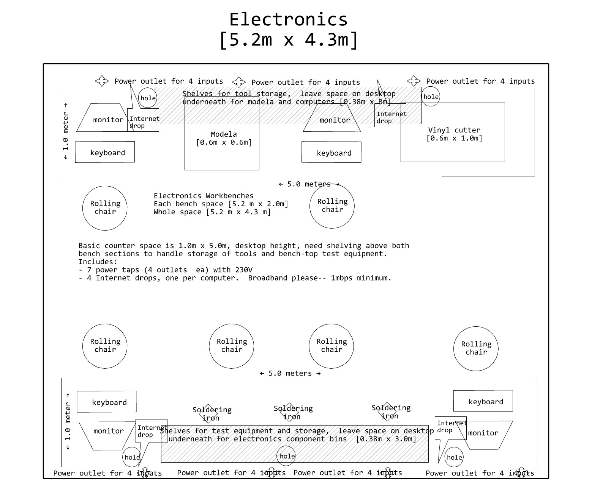
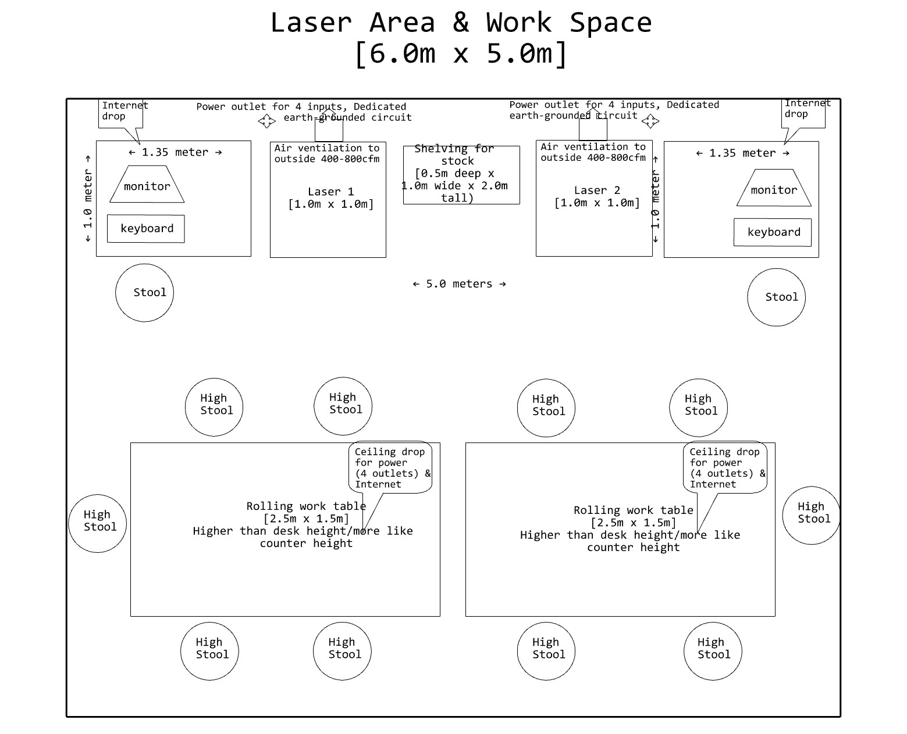
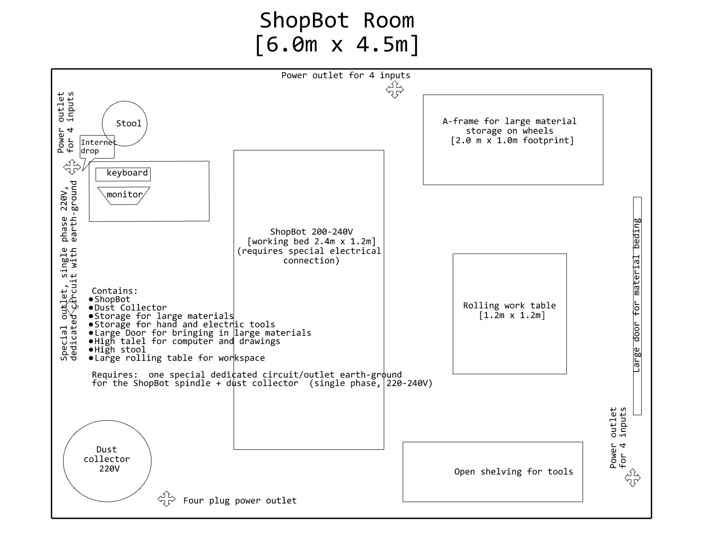
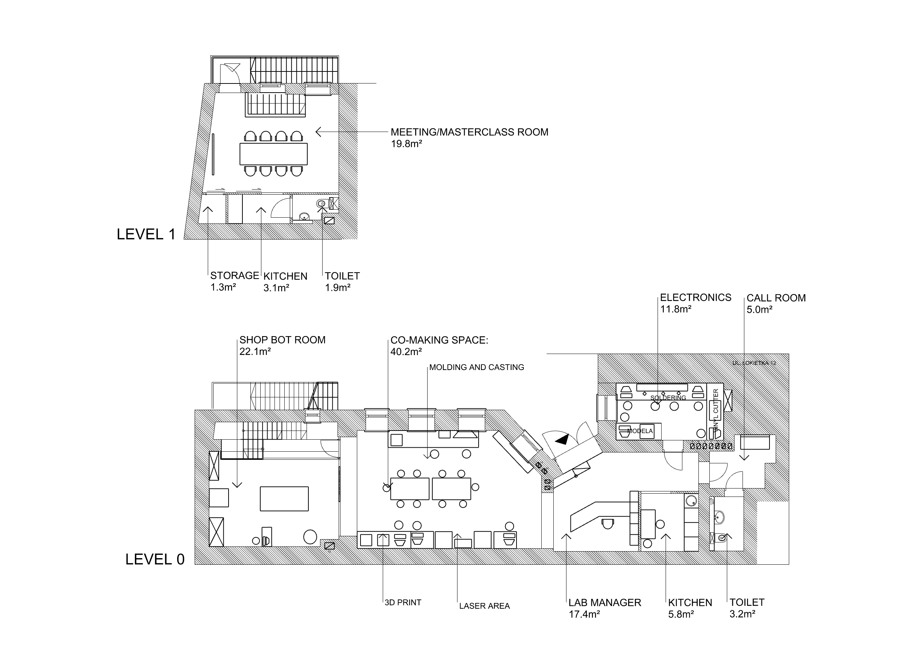

#**Fab Lab Model**

We are working on finding proper spaces and establishing new Fab Lab facilities in Poland.
We are looking for the spaces of around 100-500m2 with preferably 3.5-4m height. The model fablab spaces are sketed below. The provided drawings were prepared based on the [how to start a fab lab](https://fabfoundation.org/getting-started/#fab-lab-questions).

#**Fab Institute to be**

**Fig.** The target arrangement for the space into a Fab Institute (a Fab Academy node).
