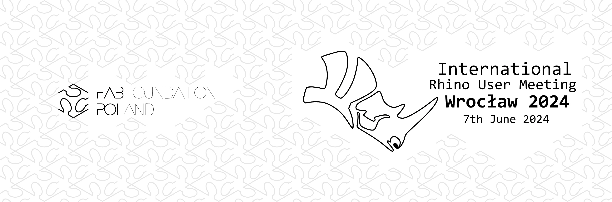

# **International Rhino User Meeting 2024 for the first time in Poland!**

**Fab Foundation Poland**, in collaboration with **McNeel Europe**, organizes an **International Rhino User Meeting in Wrocław** on the **7th June 2024** (Friday).

Get inspiration from industry experts in different fields: Architecture, BIM, Landscape, Design, Algorithmic Modeling, Rendering and Visualization, Footwear, Orthotics, 3D Printing, Robotic milling, Environmental Analysis and much more!

Get the latest news about Rhino, Grasshopper and food4Rhino apps...

Watch presentations and get hands-on with live software demonstrations from our exhibitor partners.

See previous events at: [https://events.mcneel.eu/](https://events.mcneel.eu/)

**Contact:** Judy Curie, judy@fabfoundation.pl

##**Check the detailed program!**

Preliminary Agenda available soon.

[Preliminary Agenda](https://docs.google.com/document/d/1o1dcEfPtly8Wxo-IktzwI-nctwLoe6BelZDURPr2yFs/edit?usp=sharing)

## **After hours:**
If you plan on staying in Wrocław the following weekend we can recommend you attend the 2-day advance [Rhino-Grasshopper masterclass](https://www.eventbrite.com/e/gh-masx10-masterclass-4-tickets-878433798137?utm-campaign=social&utm-content=attendeeshare&utm-medium=discovery&utm-term=listing&utm-source=cp&aff=ebdsshcopyurl) or simply enjoy Wrocław!

Some recommended attractions: [visitwroclaw.eu](https://visitwroclaw.eu/en/)
3-day in Wroclaw English guide: [pdf](https://visitwroclaw.eu/en/files-en/dokumenty/6535/3%20days%20in%20Wroclaw_EN.pdf)

##**Registration**

Attendee Ticket includes:

 - pass to the all day event (conference & exhibitor space)
 - lunch, coffee & snacks, lunch, wine and appetizers at the reception
 - access to the evening social event  (reception with live music)

<!-- Noscript content for added SEO -->
<noscript><a href="https://www.eventbrite.com/e/international-rhino-user-meeting-wrocaw-2024-tickets-876673232237" rel="noopener noreferrer" target="_blank">Buy Tickets on Eventbrite</a></noscript>
<!-- You can customize this button any way you like -->
<button id="eventbrite-widget-modal-trigger-876673232237" type="button">Buy Tickets</button>

_________

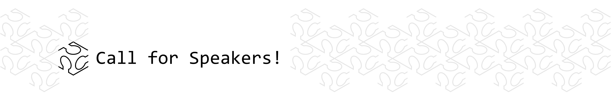
#**Call for speakers**

**Confirmed speakers:**

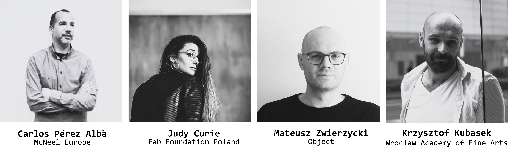

**Previous speakers:**

David Rutten (McNeel), Michael Drobnik (Herzog & de Meuron), Chritoph Wabel (ETH Zurich), Angelos Chronis (Austrian Institute of Technology), Detlef Muller (adidas AG), Tom van Mele (Compas), Ursula Frick (Blumer-Lehmann AG)
and many other distinguished academics and professionals, complete list of speakers available: [https://events.mcneel.eu/](https://events.mcneel.eu/)

##**To become a Speaker at the International Rhino User Meeting Wrocław 2024:** contact: Judy Curie, judy@fabfoundation.pl

___________
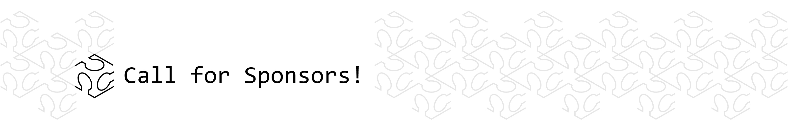
#**Call for sponsors**
International Rhino User Meeting Wroclaw
80-100 attendees expected

Offer for sponsors includes:

**1.** exhibitor booth (desk, monitor, electricity, bring your own computer and roll up banner)

**2.**  company logo and website on the official event page and in all our communications

**3.**  time for the attendees to visit your booth during registration, coffee and lunch breaks and drinks networking

**4.** one free attendee ticket & 1-minute slot presentation to the entire audience

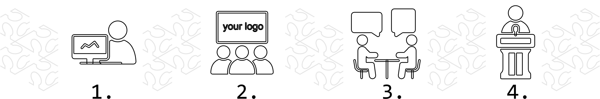

**Exhibiting partners in previous events include:**

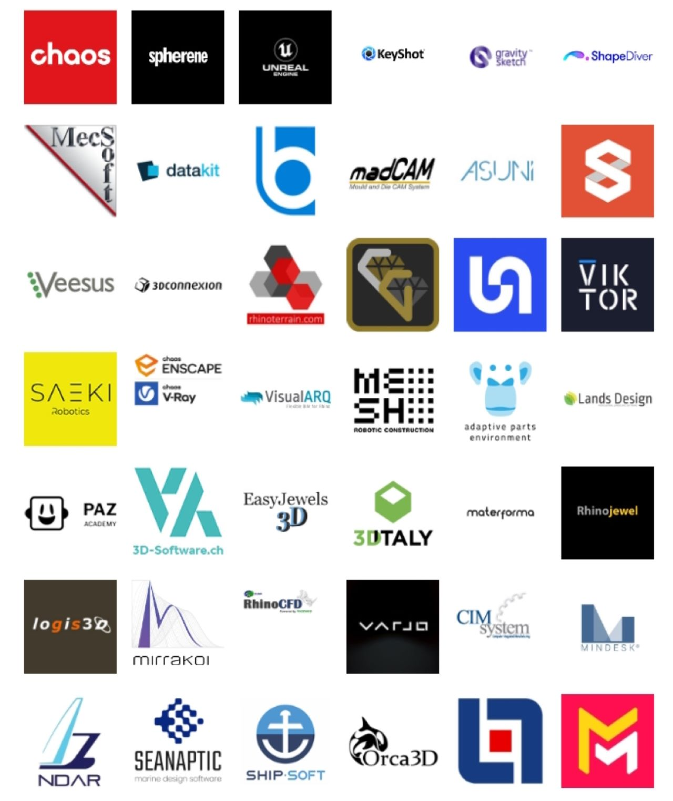

## **To become an official sponsor of the International Rhino User Meeting Wrocław 2024:** contact: Judy Curie, judy@fabfoundation.pl

______
#ACCOMPANYING workshops

On the weekend following the International Rhino User Meeting Wroclaw 2024 we are hosting 4th Masterclass of the Grasshopper Masterclass series:

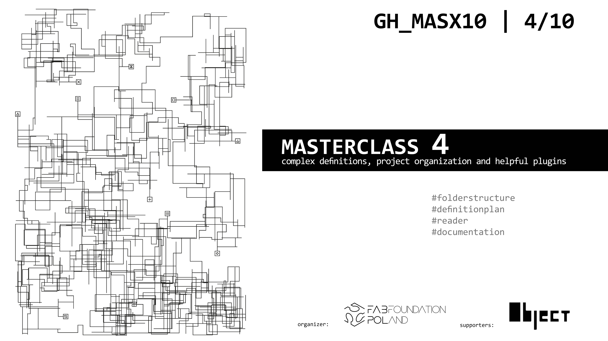
MASTERCLASS 4 | 08-09th June 2024 | complex definitions, project organization and helpful plugins
[**registration**](https://www.eventbrite.com/e/gh-masx10-masterclass-4-tickets-878433798137?utm-campaign=social&utm-content=attendeeshare&utm-medium=discovery&utm-term=listing&utm-source=cp&aff=ebdsshcopyurl)
[**more info**](https://fabfoundation.pl/ghmasterclass/)
_______
#Location

**Main event**: Bulvary, Księcia Witolda 11, 50-202 Wrocław, Poland, [Bulvary](https://bulvary.pl/)

The underground parking available.

**Workshops**: Fab Institute, Łokietka 12c, 50-243 Wrocław, Poland, [Fab Institute](https://fabfoundation.pl/nav/fablabs/fab-institute/)

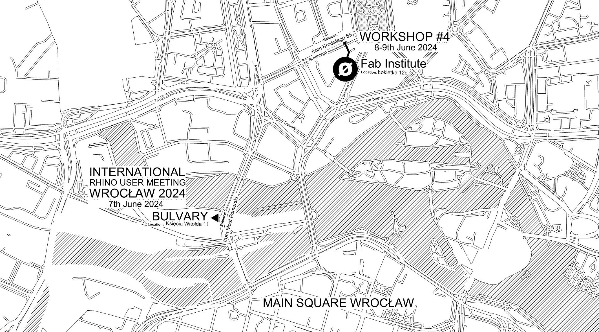
**Fig.**  Bulvary (the entrances are marked with triangles).
____________
#CONNECTIONS
**DIRECT FLIGHTS**
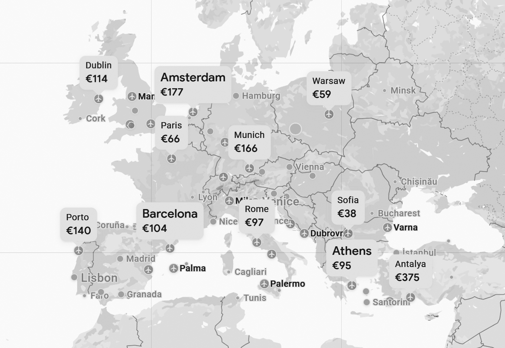
**Fig.**  Direct flight connections.

**DIRECT BUS Connections**

- Wroclaw (PL) - Vienna (AT) (around 6:40h, form 19.99€)
- Wroclaw (PL) - Berlin (DE) ( around 4:00h, form 20.99€)
- Wroclaw (PL) - Dresden (DE)( around 3:35h, form 14.99€)
- Wroclaw (PL) - Cottbus (DE) ( around 2:50h, form 11.99€)
- Wroclaw (PL) - Leipzig (DE) (around  5:20h, form 16.99€)
- Wroclaw (PL) - Brno (CZ) (around 4:45h, form 11.99€)
- Wroclaw (PL) - Prague (CZ) (around 4:00h, form 16.99€)
- Wroclaw (PL) - Liberec (CZ) (around 2:55h, form 10.99€)
- Wroclaw (PL) - Hradec Králové (CZ)(around 3:05h, form 8.99€)
- Wroclaw (PL) - Budapest (HU) (around 8:45h, form 27.99€)

**DIRECT TRAIN Connections**

- Wroclaw (PL) - Berlin (DE) (EC Train takes around 4:00h)
- Wroclaw (PL) - Vienna (AT) (EC Train takes around 8:00h)
- Wroclaw (PL) -  Warsaw (PL) (IC Train takes around 4:30h, EIP Express Train takes 3:35h)
- Wroclaw (PL) - Krakow (PL) (IC Train takes around 3:00h)

#PREVIOUS EVENTS ORGANIZED BY FAB FOUNDATION POLAND
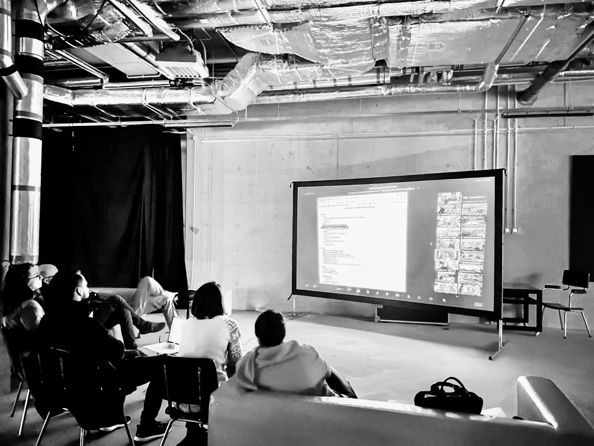
**Fig.**  Fab Academy Lectures Screenings at Bulvary.
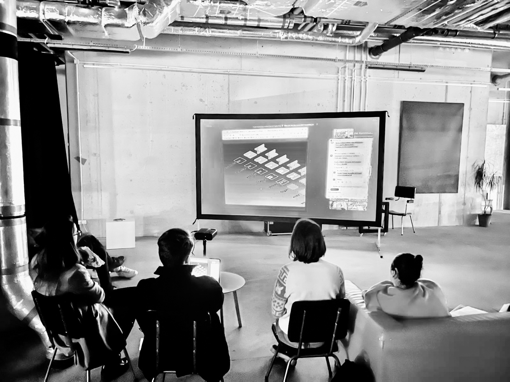
**Fig.**  Fab Academy Lectures Screenings at Bulvary.
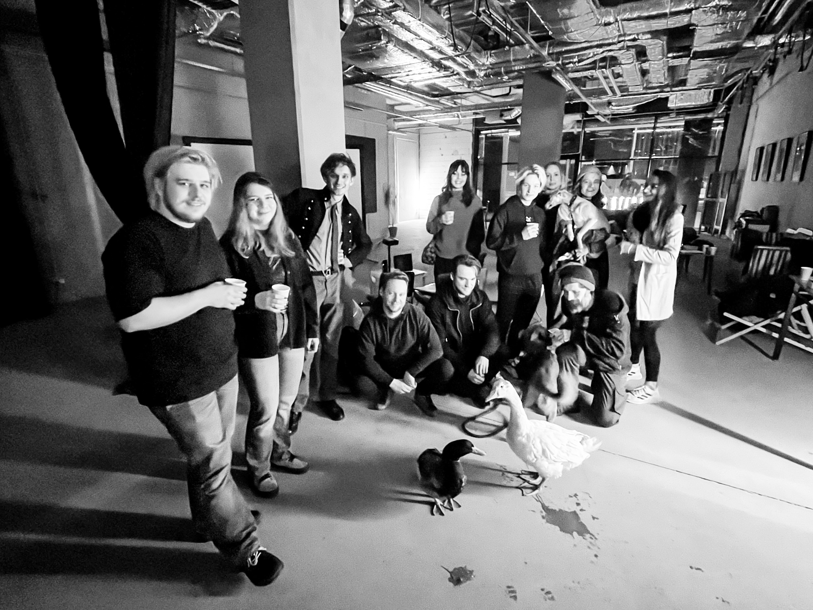
**Fig.**  Fab Academy Lectures Screenings at Bulvary.
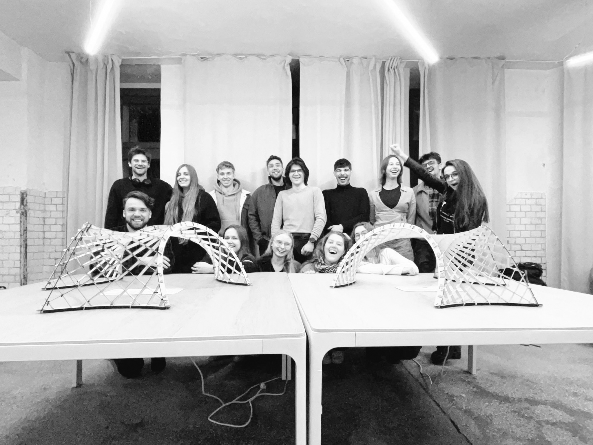
**Fig.**  OPTIshell workshop.
