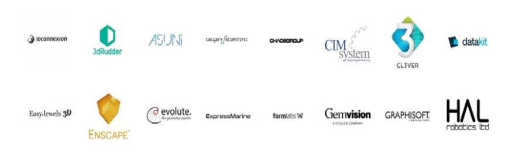
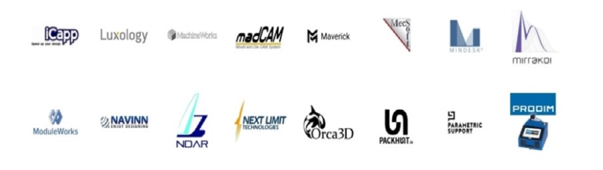

#International Rhino User Meeting Wroclaw 2024

## **International Rhino User Meeting 2024 for the first time in Poland!**

McNeel Europe, in collaboration with Fab Foundation Poland, organizes an **International Rhino User Meeting in Wrocław** on the **7th June 2024**.

Come join us and learn more about state-of-the-art Digital Design and Fabrication.All day event with amazing international speakers and exhibitors!

Get inspiration from industry experts in different fields: Architecture, BIM, Landscape, Design, Algorithmic Modeling, Rendering and Visualization, Footwear, Orthotics, 3D Printing, Robotic milling, Environmental Analysis and much more!

Get the latest news about Rhino WIP, Rhino.Inside, Rhino Compute, Hops, Grasshopper and food4Rhino apps..

Watch presentations and get hands-on with live software demonstrations from our exhibitor partners.

See previous events at: [https://events.mcneel.eu/](https://events.mcneel.eu/)

**Contact:** carlos@mcneel.com

##**Check the detailed program!**

[Preliminary Agenda](https://docs.google.com/document/d/1o1dcEfPtly8Wxo-IktzwI-nctwLoe6BelZDURPr2yFs/edit?usp=sharing)

##**Registration**

<!-- Noscript content for added SEO -->
<noscript><a href="https://www.eventbrite.com/e/international-rhino-user-meeting-wrocaw-2024-tickets-876673232237" rel="noopener noreferrer" target="_blank">Buy Tickets on Eventbrite</a></noscript>
<!-- You can customize this button any way you like -->
<button id="eventbrite-widget-modal-trigger-876673232237" type="button">Buy Tickets</button>

_________

#CALLS

##**Call for speakers**

**Confirmed speakers:**

- Carlos Perez (McNeel)
- Judy Curie (Fab Foundation Poland)

**Previous speakers:**

David Rutten (McNeel), Michael Drobnik (Herzog & de Meuron), Chritoph Wabel (ETH Zurich), Angelos Chronis (Austrian Institute of Technology), Detlef Muller (adidas AG), Tom van Mele (Compas), Ursula Frick (Blumer-Lehmann AG)
and many other distinguished academics and practiosioners, complete list of speakers available: [https://events.mcneel.eu/](https://events.mcneel.eu/)

**To become a Speaker at the International Rhino User Meeting Wrocław 2024:**
##Please fill the registration form: [**Speaker Form**](https://forms.gle/KstCTbLRr9ZhQZAG9)

##**Call for sponsosrs**
International Rhino User Meeting Wroclaw
120 attendees expected

Offer for sponsors includes:

**1.** exhibitor booth (desk, monitor, electricity, bring your own computer and roll up banner)

**2.**  company logo and website on the official event page and in all our communications

**3.**  time for the attendees to visit your booth during registration, coffee and lunch breaks and drinks networking

**4.** one free attendee ticket & 1-minute slot presentation to the entire audience

**Ehibiting partners in previous events include:**

**To become an official sponsor of the International Rhino User Meeting Wrocław 2024:**

##Please fill the registration form: [**Sponsor Form**](https://forms.gle/1EYbVYgpA7QnYEYk9)

______
#ACCOMPANYING workshops

On the weekend following the International Rhino User Meeting Wroclaw 2024 we are hosting 4th Masterclass of the Grasshopper Masterclass series:

MASTERCLASS 4 | 08-09th June 2024 | complex definitions, project organization and helpful plugins
[**more info**](fabfoundation.pl/ghmasterclass)

_______
#Location

**Main event**: Bulvary, Księcia Witolda 11, 50-202 Wrocław, Poland, [Bulvary](https://bulvary.pl/)

The underground parking available.

**Workshops**: Fab Institue, Łokietka 12c, 50-243 Wrocław, Poland, [Fab Institute](https://fabfoundation.pl/nav/fablabs/fab-institute/)

**Fig.**  Bulvary (the entrances are marked with triangles).
