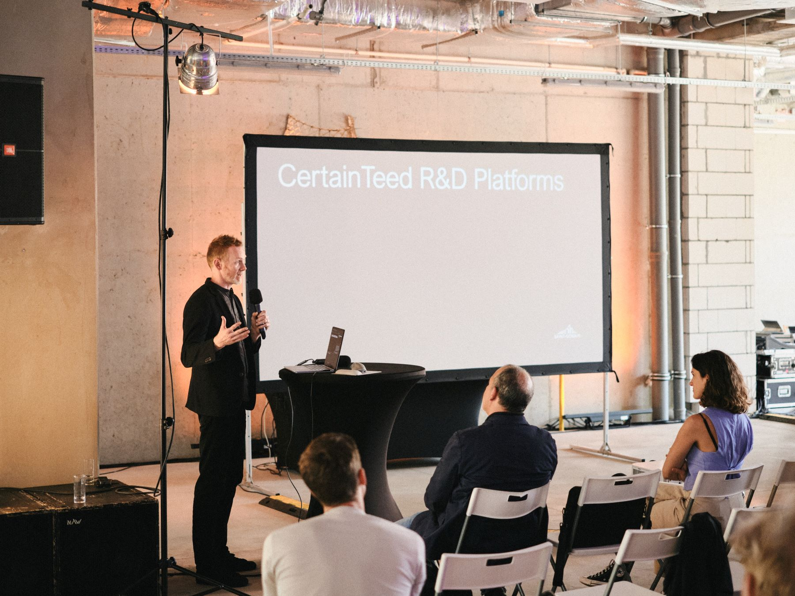

# **International Rhino User Meeting 2024 has already happended but check out our workshops: [GH_MASX10](https://fabfoundation.pl/ghmasterclass/)**

# **International Rhino User Meeting 2024 for the first time in Poland!**

##**General Information**

**Fab Foundation Poland**, in collaboration with **McNeel Europe**, organizes an **International Rhino User Meeting in Wrocław** on the **7th June 2024** (Friday).

Get inspiration from industry experts in different fields: Architecture, BIM, Landscape, Design, Algorithmic Modeling, Rendering and Visualization, Footwear, Orthotics, 3D Printing, Robotic milling, Environmental Analysis and much more!

Get the latest news about Rhino, Grasshopper and food4Rhino apps...

Watch presentations and get hands-on with live software demonstrations from our exhibitor partners.

See previous events at: [https://events.mcneel.eu/](https://events.mcneel.eu/)

**Contact:** Judy Curie, fabfoundationpoland@gmail.com

##**Check the detailed program!**

#[Agenda](https://docs.google.com/document/d/1o1dcEfPtly8Wxo-IktzwI-nctwLoe6BelZDURPr2yFs/edit?usp=sharing)

## **After hours:**
If you plan on staying in Wrocław the following weekend we can recommend you attend the 2-day advance [GH_MASX10 - MASTERCLASS 4](https://fabfoundation.pl/ghmasterclass/) or simply enjoy Wrocław! -
#**!!!MASTERCLASS 4 SOLD OUT!!!**

Some recommended attractions: [visitwroclaw.eu](https://visitwroclaw.eu/en/)
3-day in Wroclaw English guide: [pdf](https://visitwroclaw.eu/en/files-en/dokumenty/6535/3%20days%20in%20Wroclaw_EN.pdf)

##**Registration**

Attendee Ticket includes:

 - pass to the all day event (conference & exhibitor space)
 - lunch, coffee & snacks, wine and appetizers at the reception
 - access to the evening social event  (reception with live music)

#[BUY TICKETS](https://forms.gle/djkDeWRhGhALTpyv8)

##[JOIN LINKEDIN EVENT](https://www.linkedin.com/events/internationalrhinousermeeting207183176715462918144/)

_________

#**Call for speakers**

##**Confirmed speakers:**

##**Previous speakers:**

David Rutten (McNeel), Michael Drobnik (Herzog & de Meuron), Chritoph Wabel (ETH Zurich), Angelos Chronis (Austrian Institute of Technology), Detlef Muller (adidas AG), Tom van Mele (Compas), Ursula Frick (Blumer-Lehmann AG)
and many other distinguished academics and professionals, complete list of speakers available: [https://events.mcneel.eu/](https://events.mcneel.eu/)

##**To become a Speaker at the International Rhino User Meeting Wrocław 2024:**

Contact us: Judy Curie, fabfoundationpoland@gmail.com

___________

#**Call for sponsors**
International Rhino User Meeting Wroclaw
80-100 attendees expected.

##**Confirmed sponsors:**

##**Exhibiting partners in previous events:**

##**To become an official sponsor of the International Rhino User Meeting Wrocław 2024:**

 Contact us: Judy Curie, fabfoundationpoland@gmail.com

______
#**ACCOMPANYING workshops**

On the weekend following the International Rhino User Meeting Wroclaw 2024 we are hosting 4th Masterclass of the Grasshopper Masterclass series:

MASTERCLASS 4 | 08-09th June 2024 | complex definitions, project organization and helpful plugins
[**registration**](https://forms.gle/rX2ixT3q4DdfnPGD9)
[**more info**](https://fabfoundation.pl/ghmasterclass/)
#**!!!MASTERCLASS 4 SOLD OUT!!!**
_______
#**Location**

**Main event**: Bulvary, Księcia Witolda 11, 50-202 Wrocław, Poland, [Bulvary](https://bulvary.pl/)

The underground parking available.

**Workshops**: Fab Institute, Łokietka 12c, 50-243 Wrocław, Poland, [Fab Institute](https://fabfoundation.pl/nav/fablabs/fab-institute/)

**Fig.**  Bulvary & Fab Institute (the entrances are marked with triangles).

**Fig.**  Bulvary (the entrance is marked with triangle).

**Fig.**  Fab Institute (the entrance is marked with triangle).
____________
#**CONNECTIONS**
**DIRECT FLIGHTS TO WROCŁAW**

**Fig.**  Direct flight connections.

**DIRECT BUS Connections**

- Wroclaw (PL) - Vienna (AT) (around 6:40h, form 19.99€)
- Wroclaw (PL) - Berlin (DE) ( around 4:00h, form 20.99€)
- Wroclaw (PL) - Dresden (DE)( around 3:35h, form 14.99€)
- Wroclaw (PL) - Cottbus (DE) ( around 2:50h, form 11.99€)
- Wroclaw (PL) - Leipzig (DE) (around  5:20h, form 16.99€)
- Wroclaw (PL) - Brno (CZ) (around 4:45h, form 11.99€)
- Wroclaw (PL) - Prague (CZ) (around 4:00h, form 16.99€)
- Wroclaw (PL) - Liberec (CZ) (around 2:55h, form 10.99€)
- Wroclaw (PL) - Hradec Králové (CZ)(around 3:05h, form 8.99€)
- Wroclaw (PL) - Budapest (HU) (around 8:45h, form 27.99€)

**DIRECT TRAIN Connections**

- Wroclaw (PL) - Berlin (DE) (EC Train takes around 4:00h)
- Wroclaw (PL) - Vienna (AT) (EC Train takes around 8:00h)
- Wroclaw (PL) -  Warsaw (PL) (IC Train takes around 4:30h, EIP Express Train takes 3:35h)
- Wroclaw (PL) - Krakow (PL) (IC Train takes around 3:00h)
_____

#**PHOTOS shared in courtesy of FAB FOUNDATION POLAND**

All the below photos please
@ credit: Krzysztof Nazar, shared in courtesy of Fab Foundation Poland

@ credit: Krzysztof Nazar, shared in courtesy of Fab Foundation Poland

@ credit: Krzysztof Nazar, shared in courtesy of Fab Foundation Poland

@ credit: Krzysztof Nazar, shared in courtesy of Fab Foundation Poland

@ credit: Krzysztof Nazar, shared in courtesy of Fab Foundation Poland

@ credit: Krzysztof Nazar, shared in courtesy of Fab Foundation Poland

@ credit: Krzysztof Nazar, shared in courtesy of Fab Foundation Poland

@ credit: Krzysztof Nazar, shared in courtesy of Fab Foundation Poland

@ credit: Krzysztof Nazar, shared in courtesy of Fab Foundation Poland

@ credit: Krzysztof Nazar, shared in courtesy of Fab Foundation Poland

@ credit: Krzysztof Nazar, shared in courtesy of Fab Foundation Poland

@ credit: Krzysztof Nazar, shared in courtesy of Fab Foundation Poland

@ credit: Krzysztof Nazar, shared in courtesy of Fab Foundation Poland

@ credit: Krzysztof Nazar, shared in courtesy of Fab Foundation Poland

@ credit: Krzysztof Nazar, shared in courtesy of Fab Foundation Poland

@ credit: Krzysztof Nazar, shared in courtesy of Fab Foundation Poland

@ credit: Krzysztof Nazar, shared in courtesy of Fab Foundation Poland

@ credit: Krzysztof Nazar, shared in courtesy of Fab Foundation Poland

@ credit: Krzysztof Nazar, shared in courtesy of Fab Foundation Poland

@ credit: Krzysztof Nazar, shared in courtesy of Fab Foundation Poland

@ credit: Krzysztof Nazar, shared in courtesy of Fab Foundation Poland

Please find all the photos from our volonteer photographers:
#[GOOGLE DRIve - PHOTOS](https://drive.google.com/drive/folders/1hkcMZhC1JehWI-w_30pZfHEVaj9ly4Wv?usp=drive_link)

Feel free to use/share the photos, but don't forget give the credit: "credit: author name (title of the folder), shared in courtesy of Fab Foundation Poland".

We encourage you to upload your photos to the drive in the folder with your name as well :).

#**VIDEOS shared in courtesy of FAB FOUNDATION POLAND**

<iframe width="1080" height="630" src="https://www.youtube.com/embed/p4S88mAUjL8?si=nHimAa3zfzodB0Zg&amp;start=5" title="YouTube video player" frameborder="0" allow="accelerometer; autoplay; clipboard-write; encrypted-media; gyroscope; picture-in-picture; web-share" referrerpolicy="strict-origin-when-cross-origin" allowfullscreen></iframe>

#[VIDEOS](https://www.youtube.com/playlist?list=PLE5Ko9WUI1VSsGls4WuEXRAruHEGbgntE)

#**Testimonials**

 1. "It was really amazing to meet so many interesting people and talk to them. Can't wait for the next event! :)"
 Dawid Drozdz, 18th June 2024, email to FFP

2. "I attended a Rhino User Meeting and want to say it was great, packed with amazing speakers from various industries, I had a very good time and pleasure!"
Alex Khmil, 18th June 2024, email to FFP

3. "Thank you for everything, it was a wonderful event! ""
Bereczki Zoltán, 20th June 2024, email to FFP

4. "Inspiring presentations, great talks, and an incredible hashtag#Rhino3D community.""
Krysztof Wojslaw, 14th June 2024, [likendin post](https://www.linkedin.com/posts/krzysztof-wojslaw_grasshopper-rhino3d-rhino3dwroclaw2024-activity-7206547312813187072-ZoeK?utm_source=share&utm_medium=member_desktop)

5. "Inspiration is the key to propelling your career forward.

I truly believe in that phrase. That's why I attended the Rhino User Meeting in Wrocław. I was deeply inspired by the speakers and their incredible stories, and I had the pleasure of networking with fellow attendees. It was fascinating to learn how people are leveraging the latest innovations in computational design with Grasshopper, not only in the building industry but also across various sectors."
Kamil Grzebalski, 20th June 2024, [likendin post](https://www.linkedin.com/posts/kamil-grzebalski-676287234_rhino3dwroclaw2024-arup-ugcPost-7209520840470679552-UWzo?utm_source=share&utm_medium=member_desktop)
